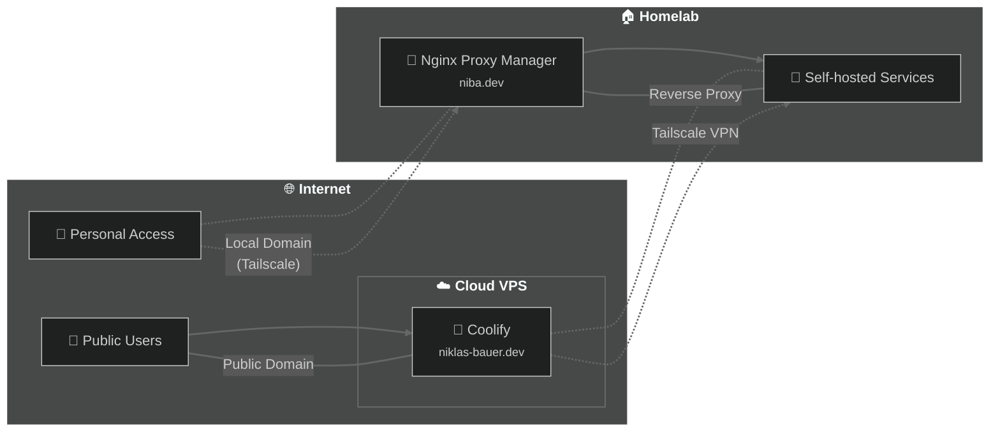

# Why bother?
With my growing interest in homelabbing and webdevelopment, I needed a flexible solution to expose services. 
These services also have different needs, my docker registry or s3 storage backend for example needs to have plenty space available. 
Other services such as web-apps need fast loading times. 
And lastly, services like paperless or nextcloud need to be accesible from everywhere, but only for me. 

Does this sound like a problem you have as well? 
Then you found the right blog post! 
This is my take on solving all of these problems for me.

# Architecture Overview

Before diving into the technical details, let's look at the high-level architecture of my setup. The diagram below shows how different components interact with each other and how both public and private access is managed.



## How It Works

In order to connect my small cloud server (CAX11 from hetzner) with my homelab, I set up a VPN with tailscale. 
On top of that, I have two domains: the one that you are currently browsing, niklas-bauer.dev, for public exposure as well as niba.dev for local services. 
Accordingly, the public domain points to the cloud server, and my private domain points to the local IP of my nginx proxy manager instance. 

The last crucial step to get this working is the exit-node in my proxmox cluster.

# Configurations

## Publically exposing a homelab service

- Navigate to Servers > Your Server > Proxy > Dynamic Configurations
- I recommend creating a separate yaml for service you want to publically expose
- Example configuration: 
```yaml 
http:
  routers:
    tailscale:
      rule: Host(`<your domain>`)
      service: <service-name>-tailscale
      tls:
        certResolver: letsencrypt
  services:
    <service-name>-tailscale:
      loadBalancer:
        servers:
          -
            url: 'http://<tailscale-ip>:<tailscale-port>'
```
- Make sure the VM / LXC is connected to your tailscale network
- In tailscale, add a new entry to your access control list: 
```yaml
"acls": [
		{"action": "accept", "src": ["<server-ip>"], "dst": ["<tailscale-ip>:<tailscale-port>"]},
        ...
]
```

## Configuring the exit-node

Read this [tailscale documentation](https://tailscale.com/kb/1019/subnets): 
- Expose the subnet routes of the services you want to reach locally
- Make sure both the exitnode, as well as the subnet route(s) are approved
- Add access rules for the advertised subnet routes
- I needed to add a group that can be referenced in this access rule: 
    ```yaml
	"groups": {
		"group:admin": ["your-email@test.com"],
	},
    ```

## Exposing a homelab service for yourself

- Requires a configured exit-node (see above)
- I recommend using Nginx Proxy Manager as reverse proxy for ease of use - point your private domain to that service
- In NPM, navigate to SSL certificates and create one certificate for "your-domain.tld" and "*.your-domain.tld"
    - Because the server is not publicly accessible, you need to setup a DNS challenge
    - Note: This won't work easily with namecheap. If you bought your domain there, use another DNS provider such as Cloudflare or Hetzner
- For each service, setup a new proxy host in NPM and make sure to reuse the global certificate 
- Done! Once you leave your local network, make sure that the device is connected to tailscale and your local domains should work (of course with TLS ;-))
- Additional hint: Took me quite some time to realize that my iPhone - due to its privacy settings - redirects the traffic through its own exit node. If you are also experiencing connection issues only on your mobile device, it's definitely worth checking
